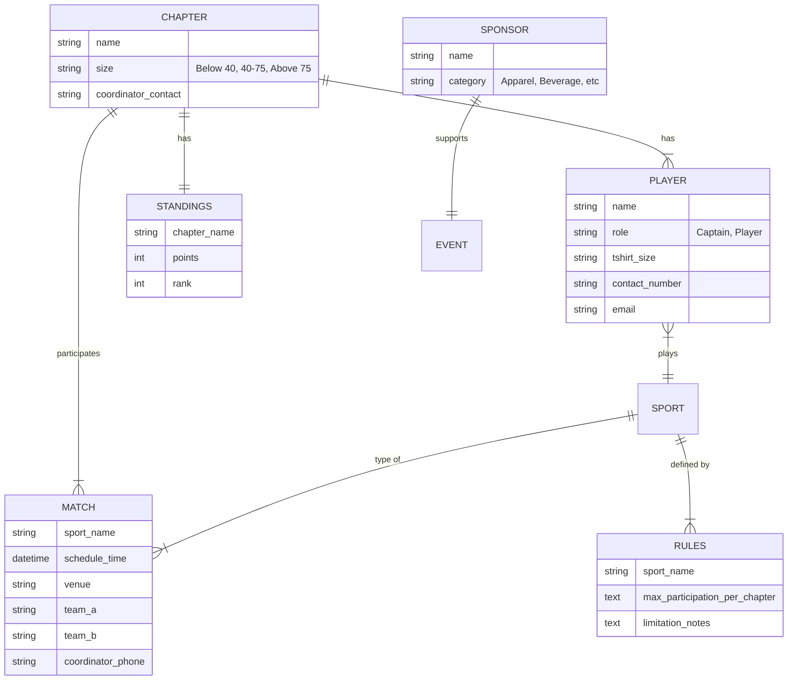
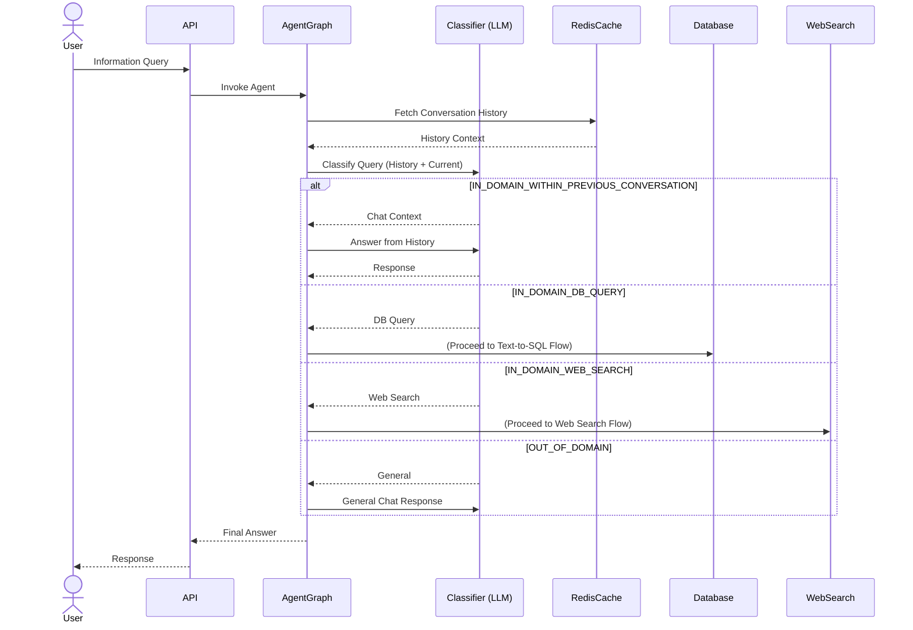
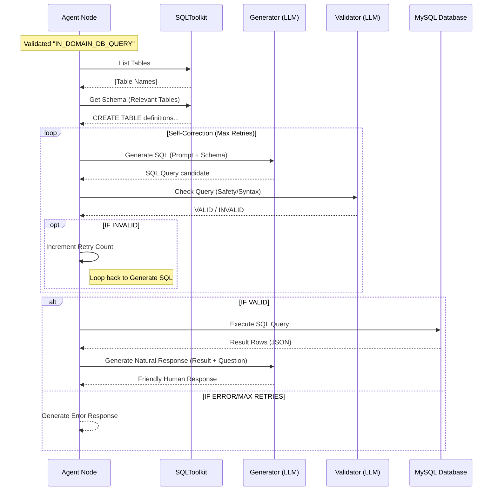
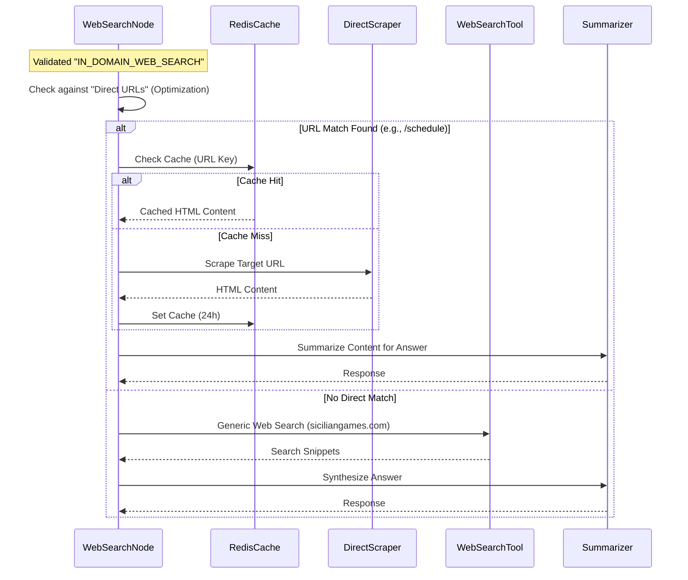
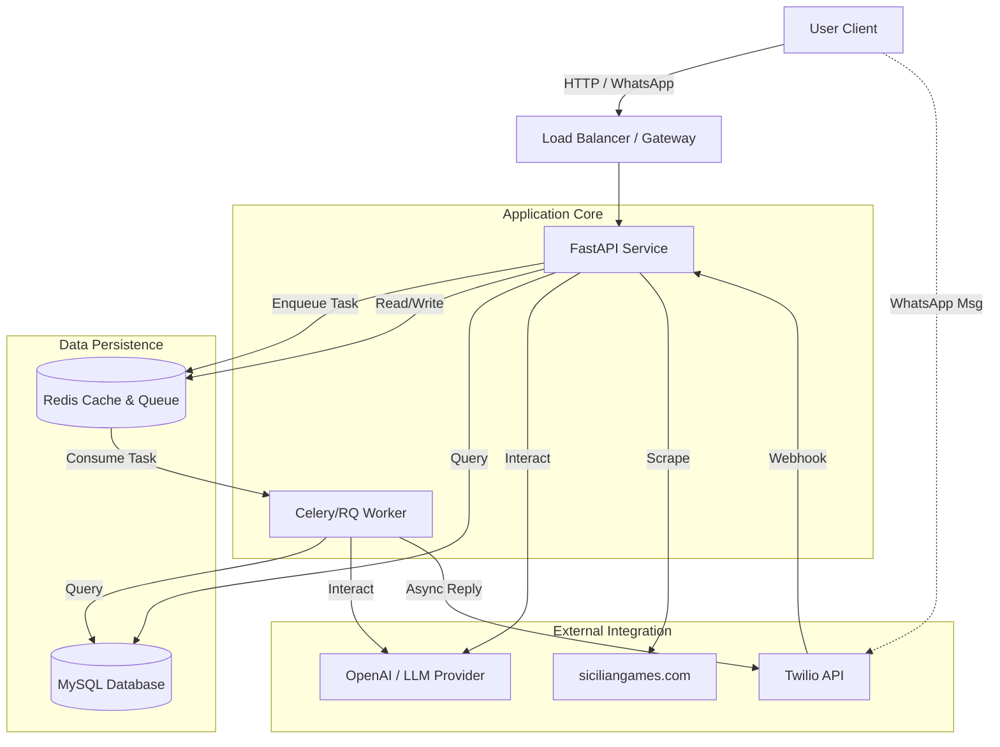
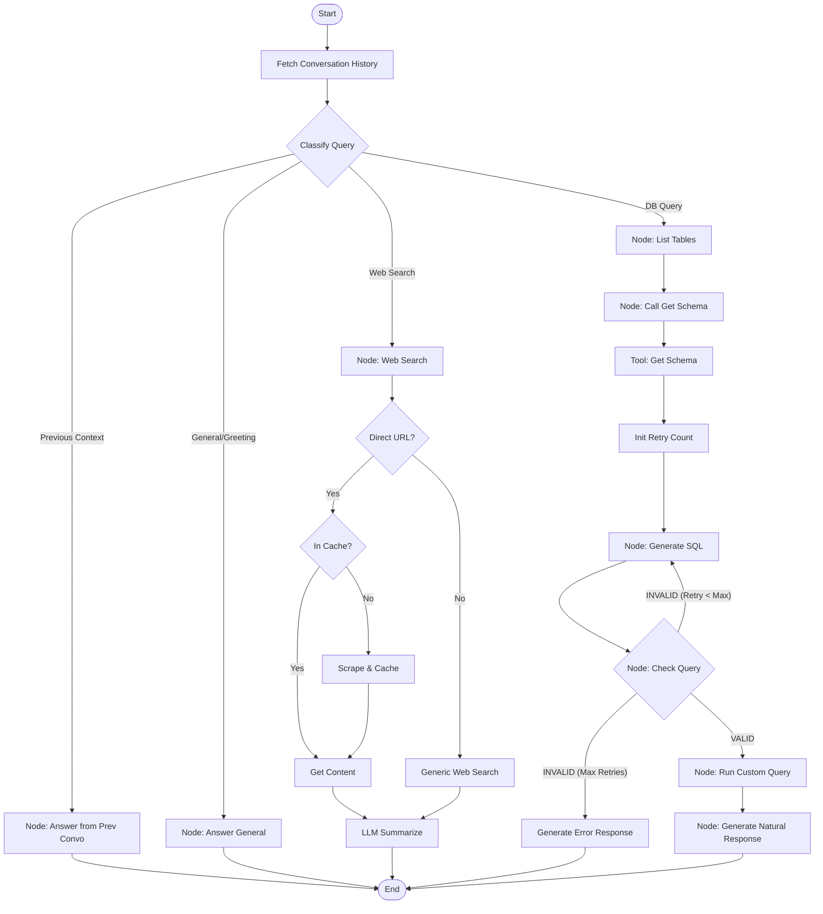
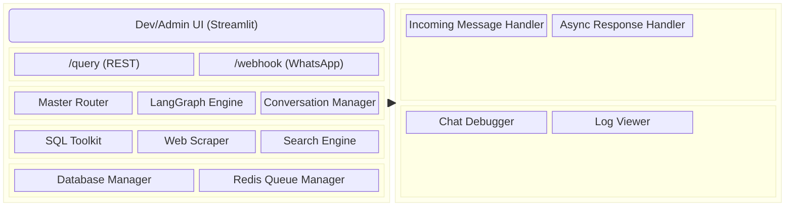

# TextToSQL Project Diagrams

This document contains architectural diagrams for the Text-to-SQL Chatbot project, covering database structure, critical sequence flows, service dependencies, agentic logic, and module features.

## 1. ER Diagram (Conceptual)

Based on the prompt templates and domain context (Sicilian Games 2025-26), the following conceptual Entity-Relationship diagram represents the data model.

## 2. Sequence Diagrams (Critical Features)

### 2.1. Master Routing Flow (Agentic Decision Making)

This flow illustrates how the system decides between using Internal Knowledge, Web Search, or Database Querying.

### 2.2. Text-to-SQL Critical Flow (DB Query)

The core logic for converting natural language to safe SQL execution.

### 2.3. Web Search Flow (Static Info)

Optimized flow for fetching general tournament information.

## 3. Service Dependency Diagram

Visualizes the external and internal services needed for the system to function.

## 4. Agentic Flow Diagram (Detailed)

Detailed internal logic of the LangGraph agent.

## 5. Module Feature Diagram

Breakdown of features across Frontend and Backend modules.

