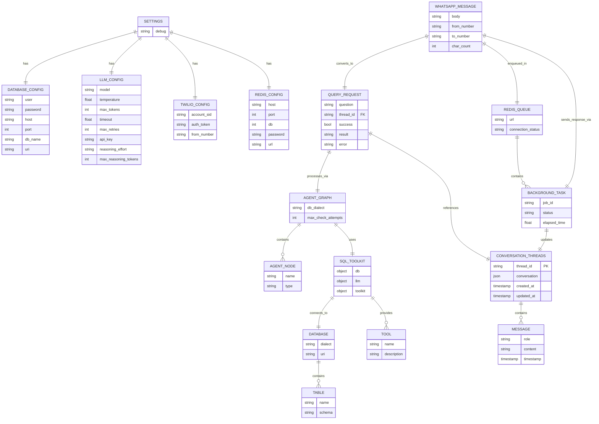

# Entity-Relationship Diagram - Text-to-SQL Chatbot

## ER Diagram (Mermaid Syntax)

## Entity Descriptions

### Core Entities

**CONVERSATION_THREADS**
- Stores conversation history for each user/thread
- Primary Key: `thread_id` (VARCHAR 255)
- Attributes: `conversation` (JSON), `created_at`, `updated_at`
- Purpose: Persistent storage of conversation context

**MESSAGE**
- Individual messages within a conversation
- Attributes: `role` (user/assistant/system), `content`, `timestamp`
- Relationship: Contained within CONVERSATION_THREADS

### Configuration Entities

**SETTINGS**
- Application-wide configuration container
- Contains: DATABASE_CONFIG, LLM_CONFIG, TWILIO_CONFIG, REDIS_CONFIG
- Purpose: Centralized configuration management

**DATABASE_CONFIG**
- Database connection parameters
- Attributes: user, password, host, port, db_name
- Generates: URI for database connection

**LLM_CONFIG**
- Language Model configuration
- Attributes: model, temperature, max_tokens, timeout, max_retries, api_key, reasoning_effort
- Purpose: LLM initialization and behavior control

**TWILIO_CONFIG**
- WhatsApp messaging service configuration
- Attributes: account_sid, auth_token, from_number
- Purpose: Twilio integration for WhatsApp

**REDIS_CONFIG**
- Redis queue configuration
- Attributes: host, port, db, password
- Generates: URL for Redis connection

### Processing Entities

**QUERY_REQUEST**
- User query request model
- Attributes: question, thread_id (FK), success, result, error
- Purpose: API request/response handling

**WHATSAPP_MESSAGE**
- Incoming WhatsApp message
- Attributes: body, from_number, to_number, char_count
- Purpose: Message reception and validation

**BACKGROUND_TASK**
- Asynchronous task in Redis Queue
- Attributes: job_id, status, elapsed_time
- Purpose: Background processing of messages

**REDIS_QUEUE**
- Redis job queue
- Attributes: url, connection_status
- Purpose: Asynchronous task management

### Agent & Tool Entities

**AGENT_GRAPH**
- LangGraph state machine for query processing
- Attributes: db_dialect, max_check_attempts
- Purpose: Orchestrates multi-step agent workflow

**AGENT_NODE**
- Individual nodes in the agent graph
- Types: fetch_conversation_history, classify_query, answer_general, list_db_tables, call_get_schema, generate_query, check_query, run_custom_query, generate_response
- Purpose: Specific processing steps

**SQL_TOOLKIT**
- Wrapper for SQL database operations
- Contains: db, llm, toolkit, available_tools
- Tools: sql_db_schema, sql_db_query, sql_db_list_tables, sql_db_query_checker

**DATABASE**
- Connected database instance
- Attributes: dialect, uri
- Purpose: Database connection and schema access

**TABLE**
- Database tables
- Attributes: name, schema
- Purpose: Represents queryable database tables

## Relationships

| From | To | Type | Description |
|------|-----|------|-------------|
| CONVERSATION_THREADS | MESSAGE | 1:N | Thread contains multiple messages |
| SETTINGS | DATABASE_CONFIG | 1:1 | Settings has database configuration |
| SETTINGS | LLM_CONFIG | 1:1 | Settings has LLM configuration |
| SETTINGS | TWILIO_CONFIG | 1:1 | Settings has Twilio configuration |
| SETTINGS | REDIS_CONFIG | 1:1 | Settings has Redis configuration |
| AGENT_GRAPH | AGENT_NODE | 1:N | Graph contains multiple nodes |
| AGENT_GRAPH | SQL_TOOLKIT | 1:1 | Graph uses SQL toolkit |
| SQL_TOOLKIT | DATABASE | 1:1 | Toolkit connects to database |
| SQL_TOOLKIT | TOOL | 1:N | Toolkit provides multiple tools |
| DATABASE | TABLE | 1:N | Database contains multiple tables |
| QUERY_REQUEST | AGENT_GRAPH | N:1 | Requests processed via graph |
| QUERY_REQUEST | CONVERSATION_THREADS | N:1 | Requests reference conversation threads |
| WHATSAPP_MESSAGE | QUERY_REQUEST | 1:1 | Message converted to query request |
| WHATSAPP_MESSAGE | REDIS_QUEUE | N:1 | Messages enqueued in Redis |
| REDIS_QUEUE | BACKGROUND_TASK | 1:N | Queue contains background tasks |
| BACKGROUND_TASK | CONVERSATION_THREADS | N:1 | Tasks update conversation threads |
| BACKGROUND_TASK | WHATSAPP_MESSAGE | 1:1 | Tasks send responses via WhatsApp |

## Data Flow

1. **WhatsApp Message Reception** → WHATSAPP_MESSAGE
2. **Queue Enqueue** → REDIS_QUEUE → BACKGROUND_TASK
3. **Query Processing** → QUERY_REQUEST → AGENT_GRAPH
4. **Agent Execution** → AGENT_NODE (multiple steps)
5. **Database Access** → SQL_TOOLKIT → DATABASE → TABLE
6. **Conversation Storage** → CONVERSATION_THREADS → MESSAGE
7. **Response Delivery** → WHATSAPP_MESSAGE (response)

## Module Mapping

| Module | Entities |
|--------|----------|
| `config/settings.py` | SETTINGS, DATABASE_CONFIG, LLM_CONFIG, TWILIO_CONFIG, REDIS_CONFIG |
| `core/database.py` | DATABASE |
| `core/llm.py` | LLM_CONFIG |
| `core/conversation.py` | CONVERSATION_THREADS, MESSAGE |
| `tools/toolkit.py` | SQL_TOOLKIT, TOOL |
| `agents/graph_builder.py` | AGENT_GRAPH |
| `agents/nodes.py` | AGENT_NODE |
| `api/endpoints.py` | QUERY_REQUEST |
| `queue/tasks.py` | WHATSAPP_MESSAGE, BACKGROUND_TASK |
| `queue/worker.py` | REDIS_QUEUE |
